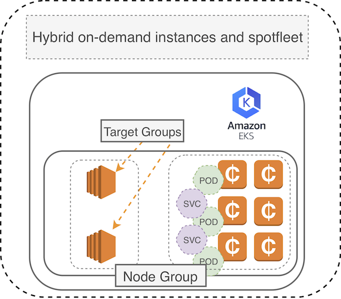

# eks-templates


#### Amazon EKS nodeGroup ASG with multiple instance types and purchase options support

*A cloudformation template for Amazon EKS nodegroup that helps you provision a single EC2 autoscaling group with multiple instance types and purchase options*




## HOWTO

1. Use **eksctl** to provision your Amazon EKS cluster([walkthrough guide](https://github.com/pahud/amazon-eks-workshop/blob/master/00-getting-started/create-eks-with-eksctl.md))
2. Use this alternative cloudformation template to update the nodegroup created by **eksctl** - https://s3-us-west-2.amazonaws.com/pahud-cfn-us-west-2/eks-templates/cloudformation/nodegroup.yaml

This template will create a single ASG that leverages the latest feature to mix multiple instance types and purchase as a single K8s nodegroup.

see [New – EC2 Auto Scaling Groups With Multiple Instance Types & Purchase Options](https://aws.amazon.com/tw/blogs/aws/new-ec2-auto-scaling-groups-with-multiple-instance-types-purchase-options/) for details.


## Features

- [x] Fully support the latest Autoscaling Group features to hybrid on-demand and spot instances
- [x] No need to create a seperate SpotFleet
- [x] on-demand instances will have node label **ondemand=yes**
- [x] spot instances will have node label **spotfleet=yes** and a **spotInstance=true:PreferNoSchedule** taint
- [x] support private subnets
- [x] support non-RFC1918 IP/CIDR VPC subnets
- [x] support the latest EKS-optimized AMI auto selection


## AWS CLI sample

You may use `aws-cli` to deploy the cloudformation stack as below with your own parameter overrides.

```
#!/bin/bash

yaml='nodegroup.yaml'
clustername='eksdemo11'
nodegroupname='ng'
stackname="${clustername}-${nodegroupname}"

aws cloudformation deploy --template-file $yaml  \
--stack-name  $stackname \
--capabilities CAPABILITY_IAM \
--parameter-overrides \
VpcId=vpc-08c3863c3d043f66a \
ClusterControlPlaneSecurityGroup=sg-028abcec6b7d2cef3 \
ClusterName=$clustername \
KeyName=aws-pahud \
NodeGroupName=$nodegroupname \
ASGAutoAssignPublicIp=no \
InstanceTypesOverride=t3.medium,t3.large,t3.xlarge \
NodeAutoScalingGroupMinSize=1 \
NodeAutoScalingGroupDesiredSize=4 \
NodeAutoScalingGroupMaxSize=5 \
Subnets=subnet-01afddf2fa02affaf,subnet-0be531a55836fef9c,subnet-052e393860f11bde9
```


## Node Labels, Taints and Tolerations

By default, all the on-demand instances will have **asgnode=yes** label while spot instances will have **spotfleet=yes**. Use the node selector to better schedule your workload


Additionally, all the spot instances have a **spotInstance=true:PreferNoSchedule** taint. To deploy your Pod on spot instances, use the node label selector to specify **spotfleet=yes**, otherwise the pod will not be scheduled on the spot instances unless it has relevant toleration. ([Taint and Toleration in Kubernetes](https://kubernetes.io/docs/concepts/configuration/taint-and-toleration/)).


# Spot Termination Handling

Worried about the spot instance termination? Check [**pahud/eks-lambda-drainer**](https://github.com/pahud/eks-lambda-drainer) to learn how to handle the spot instance termination 120 seconds before the final execution of the termination and get your all running pods re-scheduled onto another node.
